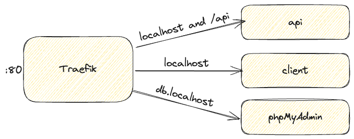

# Easy HTTP routing with Traefik

This sample app accompanies the [Easy HTTP routing with Traefik](#) guide. 

While this repo is being maintained, the application is purposely simplified to allow the focus to remain on the content of the guide. In this example, the app could be a single service. But, the point is to demonstrate how various services could be split out and HTTP routing simplified through the use of a reverse proxy (such as a React frontend with a Node/Java/.NET/anything else backend).

## Try it out

1. Clone this repo
2. Run `docker compose up`
3. Open the site at http://localhost. Requests to get data will go to `/api/message`, which is routed to the API service.
4. Open phpMyAdmin (database visualizer) at http://db.localhost

When you're done, run `docker compose down` to tear everything down.

## Contributing

Find a bug? Feel free to create an issue or submit a PR. 

If you have a feature request, feel free to open an issue. Be mindful that this repo is intended to serve as a sample for a specific guide. Therefore, features that go beyond the scope of the guide are likely to be rejected.