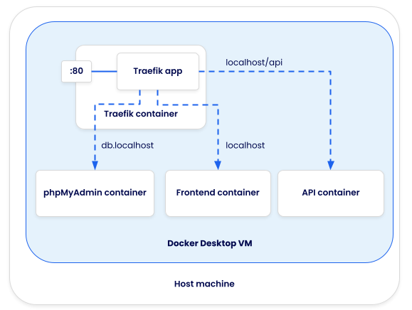

# Easy HTTP routing with Traefik

This sample app accompanies the [Easy HTTP routing with Traefik](#) guide. The application is purposely kept simple to allow the focus to remain on the content of the guide - HTTP routing with Traefik. With Traefik, it is easy to use multiple services to split development tooling or provide additional visualization and troubleshooting tools.

Notice: This sample repo is intended to support the guide mentioned above. As such, the application code is purposely kept simple to keep the focus on the guide's content and should not be considered production ready.

## Try it out

1. Clone this repo
2. Run `docker compose up`
3. Open the site at http://localhost. Requests to get data will go to `/api/message`, which is routed to the API service.
4. Open phpMyAdmin (database visualizer) at http://db.localhost

When you're done, run `docker compose down` to tear everything down.

## Contributing

Since this project is intended to support a specific use case guide, contributions are limited to bug fixes or security issues. If you have a question, feel free to open an issue!